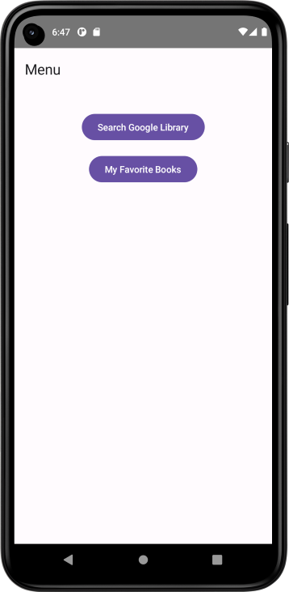
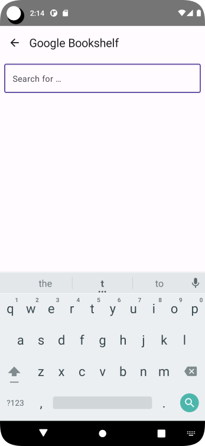
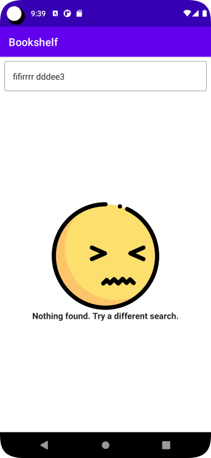
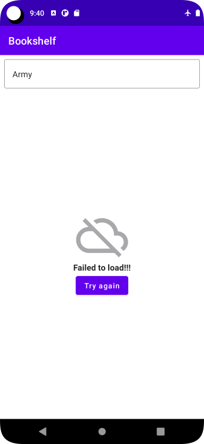
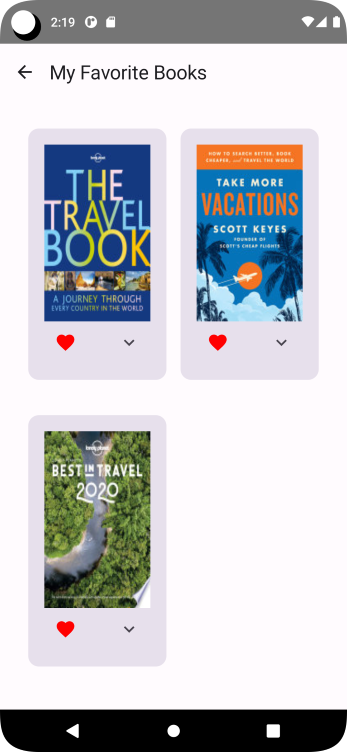
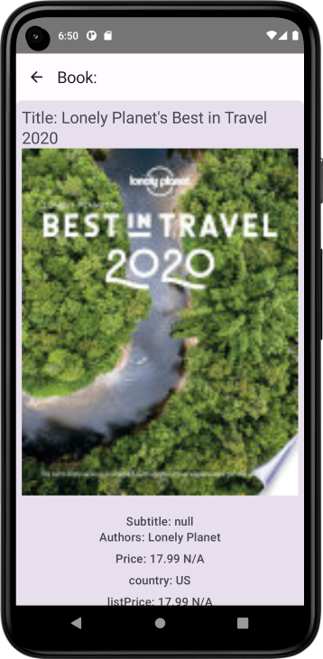

# Demo Internet Access App - Bookshelf App
Simple app to demonstrate internet access.  
The app lets the user Search for Books via Google Book API  
The App display asynchronously downloaded images of the books along with their titles in a vertical grid.  

### In Addition to project requirements I did the following
- Added new feature. Tag book as favorite
  - A favorite button is displayed with each book item
  - Clicking on the Favorite Button add/removes the book from the favorite list  
  - A new Favorite Book screen (Display the list of books that have been 
tagged as favorite)
  - New Book Detail Screen (via clicking on a book)  
**Note** - Favorite books is not saved to a Room database, (have not learned room DB yet, will return to this project for that)

### Some goals
- use Google Book API
- multiple screens to use NavHost
- Use repository
- Use Dependency Injection Container
- use multiple viewModels
- use multiple uiState
- allow user to search
- NavigateUp(Back Arrow in TopAppBar)
- use rememberScrollState

## Need to Revisit
- Search for string "Questions:"
  - Basically.... How not to pass the viewModel downwards to composables
  - Hoist Favorites up a couple of composables up.. not sure how to do it
  - bold just a part of the string?
  - not repeat/duplicate code block for factory

[App was a based on Codelab "Project: Create a Bookshelf app" at developer.android](https://developer.android.com/courses/pathways/android-basics-compose-unit-5-pathway-2#codelab-https://developer.android.com/codelabs/basic-android-kotlin-compose-bookshelf )

### ScreenShots

  
  
  

  
  
  
  

---

ref: codelab-bookshelf-app-android-kotlin-compose