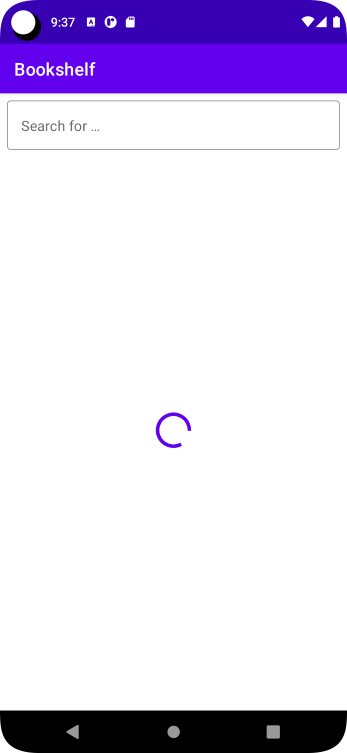

# Demo Internet Access App - Bookshelf App

Simple app to demonstrate internet access.
The App display asynchronously downloaded images of the books along with their titles in a vertical grid.
Clicking on an item in Grid brings up a Details Screen
In Addition the app lets the user Search for Books
We can favor/un-favor books. These will be displayed in a favorite screen

Some goals
- use Google Book API
- multiple screens to use NavHost
- Use repository
- Use Dependency Injection Container
- use multiple viewModels
- use multiple uiState
- allow user to search
- NavigateUp(Back Arrow in TopAppBar)
- use rememberScrollState

## Need to Revisit
- Search for string "Questions:"
  - Basically.... How not to pass the viewModel downwards to composables
  - Hoist Favorites up a couple of composables up.. not sure how to do it
  - bold just a part of the string?
  - not repeat/duplicate code block for factory

[App was a based on Codelab "Project: Create a Bookshelf app" at developer.android](https://developer.android.com/courses/pathways/android-basics-compose-unit-5-pathway-2#codelab-https://developer.android.com/codelabs/basic-android-kotlin-compose-bookshelf )

### ScreenShots

  
  
  

  
  
  

---

ref: demo-internet-access-bookshelf-app-android-kotlin-compose